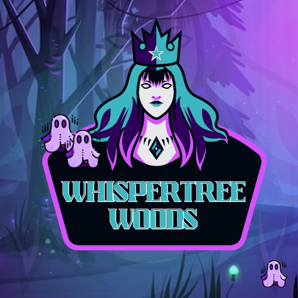

# Whispertree Woods 🧚

## About 
Let's take a walk through the forest of the Whispertree Woods. The location is inspired by the magic of lights and energy of fireflys and bioluminiscene. Since this natural spectacle gives off a lot of energy in real life, today you experience this natural wonder virtually in this little fun game. You'll embark the magical woods as a fairy in search of energy.

## Gameplay
As the **fairy**, you will float through the mystical Whispertree Woods to get back your energy within 40 seconds. Equipped with a **flashlight**, you need to shoot the **randomly appearing souls** with the light of your lamp to collect and inhale their energy. The game relies on collision which means that if your *lightning-shoot collides with a soul*, this will be counted by *+10%* on your energy level. If you *touch a soul*, your energy level decreases by *-5%*.

If your energy level or the time is equal 0, the game is over. 
For sure you can restart a new game.

## Controls
- >`Arrow keys`: Use your arrow keys to move the fairy in all directions.
- >`Spacebar`: Click to light up souls with your lamp and inhale their energy to increase your own.

⚡👻👻👻 [Click here to hunt for energy!](https://chiara888.github.io/OOP-Game/) 👻👻👻⚡